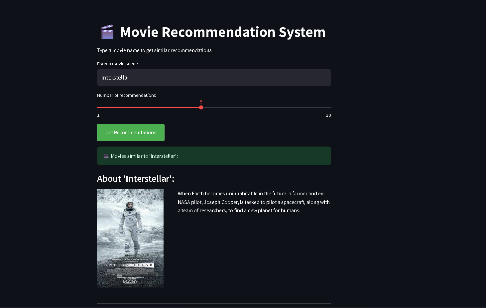
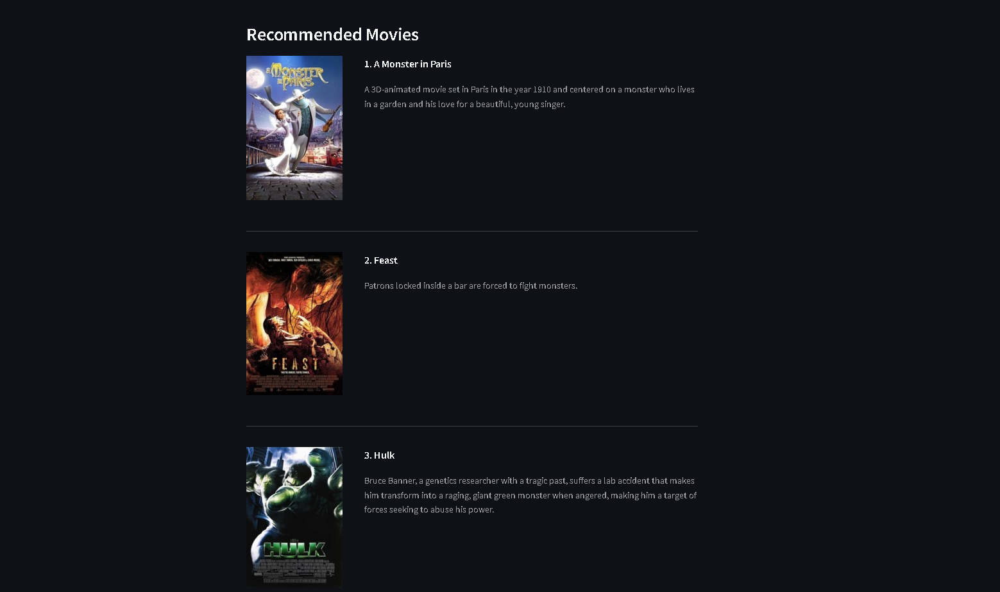

# 🎬 Movie Recommendation System

[](https://your-streamlit-app-url.com)

A content-based recommender using TF-IDF and cosine similarity, enhanced with OMDB API for rich movie details.

## Features
- **Personalized Recommendations**: Finds similar movies based on genres, plot, cast
- **Rich UI**: Displays posters and plot summaries
- **Scalable Design**: Cached similarity matrix for fast responses

## Tech Stack
- Python (Pandas, NLTK, Scikit-learn)
- Streamlit (Deployment)
- OMDB API (Movie metadata)

## How to Run
```bash
pip install -r requirements.txt
streamlit run app/app.py
```
## 📸 Application Preview

<div align="center">
  
  
  
  <br>
  <em>Left: Main interface | Right: Recommendation results</em>
</div>

## Sample Output
 

 <!-- Add screenshot -->

## Future Work
- [ ] Add user ratings (Hybrid Filtering)
- [ ] Deploy on AWS
